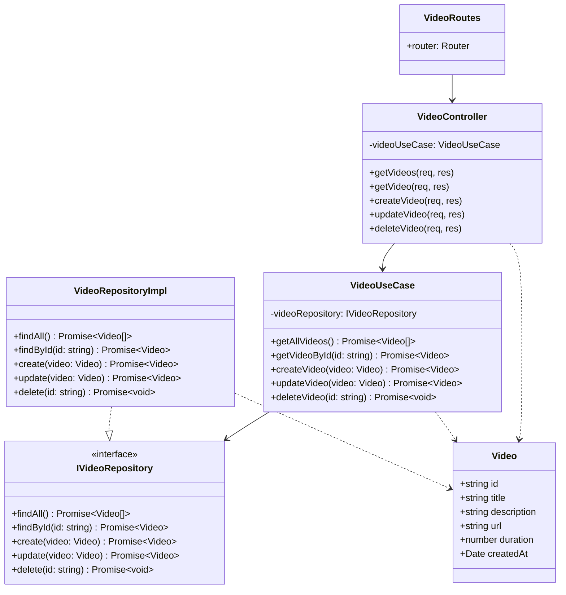
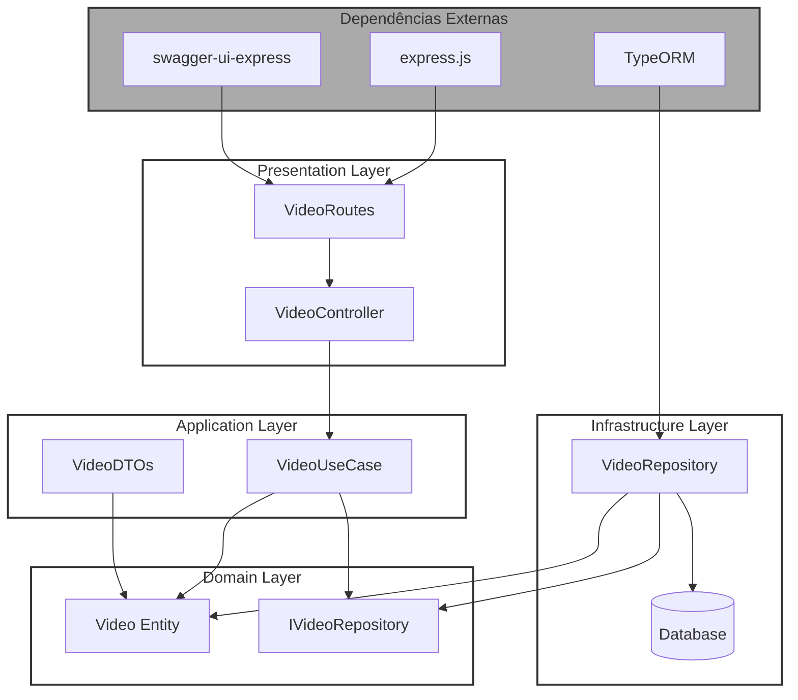

# ✏️ Arquitetura do projeto

## Diagrama de classes

```mermaid
classDiagram
    %% Domain Layer
    class Video {
        +string id
        +string title
        +string description
        +string url
        +number duration
        +Date createdAt
    }
    
    class IVideoRepository {
        <<interface>>
        +findAll() Promise~Video[]~
        +findById(id: string) Promise~Video~
        +create(video: Video) Promise~Video~
        +update(video: Video) Promise~Video~
        +delete(id: string) Promise~void~
    }

    %% Application Layer
    class VideoUseCase {
        -videoRepository: IVideoRepository
        +getAllVideos() Promise~Video[]~
        +getVideoById(id: string) Promise~Video~
        +createVideo(video: Video) Promise~Video~
        +updateVideo(video: Video) Promise~Video~
        +deleteVideo(id: string) Promise~void~
    }

    %% Presentation Layer
    class VideoController {
        -videoUseCase: VideoUseCase
        +getVideos(req, res)
        +getVideo(req, res)
        +createVideo(req, res)
        +updateVideo(req, res)
        +deleteVideo(req, res)
    }

    class VideoRoutes {
        +router: Router
    }

    %% Infrastructure Layer
    class VideoRepositoryImpl {
        +findAll() Promise~Video[]~
        +findById(id: string) Promise~Video~
        +create(video: Video) Promise~Video~
        +update(video: Video) Promise~Video~
        +delete(id: string) Promise~void~
    }

    VideoRepositoryImpl ..|> IVideoRepository
    VideoUseCase --> IVideoRepository
    VideoController --> VideoUseCase
    VideoRoutes --> VideoController
    VideoRepositoryImpl ..> Video
    VideoUseCase ..> Video
    VideoController ..> Video
```

## Diagrama de dependências

```mermaid
graph TD
    %% External Dependencies
    subgraph External["Dependências Externas"]
        Express[express.js]
        Swagger[swagger-ui-express]
        TypeORM[TypeORM]
    end

    %% Presentation Layer
    subgraph Presentation["Presentation Layer"]
        Routes[VideoRoutes]
        Controller[VideoController]
    end

    %% Application Layer
    subgraph Application["Application Layer"]
        UseCase[VideoUseCase]
        DTOs[VideoDTOs]
    end

    %% Domain Layer
    subgraph Domain["Domain Layer"]
        Entity[Video Entity]
        IRepo[IVideoRepository]
    end

    %% Infrastructure Layer
    subgraph Infrastructure["Infrastructure Layer"]
        Repository[VideoRepository]
        Database[(Database)]
    end

    %% Dependencies
    Express --> Routes
    Routes --> Controller
    Controller --> UseCase
    UseCase --> IRepo
    UseCase --> Entity
    Repository --> IRepo
    Repository --> Entity
    Repository --> Database
    DTOs --> Entity
    Swagger --> Routes
    TypeORM --> Repository

    %% Styling
    classDef external fill:#aaa,stroke:#333,stroke-width:2px
    classDef layer fill:#fff,stroke:#333,stroke-width:2px
    class External external
    class Presentation,Application,Domain,Infrastructure layer
```
